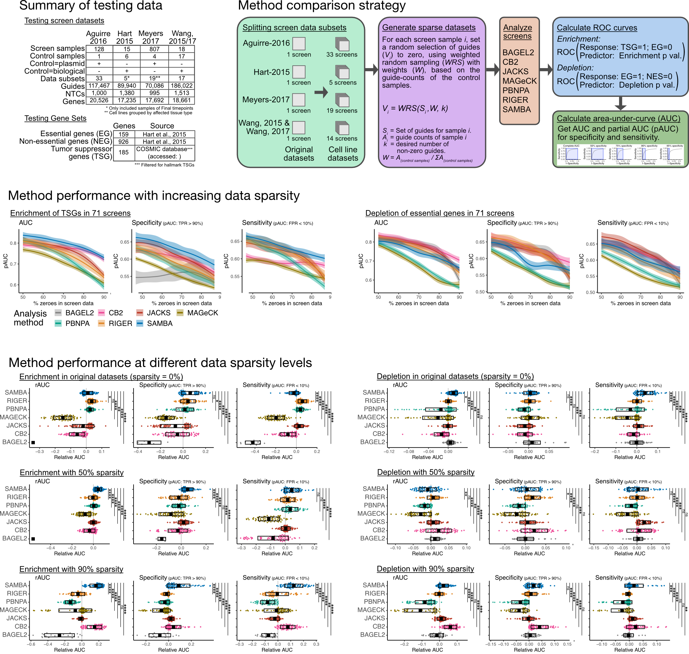

## SAMBA
CRISPR Screen Analysis Method with emperical Bayes estimation for
    Aggregated gene scoring (SAMBA). 

This analysis algorithm fit CRISPR screen data with negative binomial generalized linear models
(GLMs) with guide-wise quasi-dispersion estimates using empirical Bayes moderation. The 
posterior Bayesian estimates for each guide are then used to calculate gene-level scores with 
a modified weighted-sum algorithm. For each gene score, p values are calculated based on a null 
distribution of randomly sampled guide-sets (dummy genes). 


## Benchmarking SAMBA performance for enrichment screens and with sparse datasets
To assess the performance of SAMBA to detect screen enrichment with sparse datasets, we benchmarked SAMBA against popular CRISPR screen analysis algorithms: BAGEL2 (Kim and Hart, Genome Med 2021), CB2 (Jeong et al., Genome Res 2019), JACKS (Allen et al., Genome Res 2019), MAGeCK (Li et al., Genome Biol 2014), PBNPA (Jia et al., BMC Genomics 2017), and Riger (RigerJ Java implementation: https://github.com/broadinstitute/rigerj). Specifically, the algorithms were used to analyze 71 CRISPR screen datasets of cancer cell proliferation/survival, generated from five large-scale publications (Wang et al., Science 2015; Wang et al., Cell 2017; Aguirre et al., Cancer Discov 2016; Meyers et al., Nat Genet 2017), and by assessing  area-under-curve (AUC) values. AUC was calculated with p values as the predictors for tumor suppressor genes (TSG; COSMIC database: https://cancer.sanger.ac.uk/cosmic; filtered for hallmark TSG; accessed on July 20, 2022) as a response of screen enrichment, or essential genes as a response of screen depletion (Hart et al., Cell 2015). We also summarized specificity and sensitivity using partial-AUC analyses (range: 0.8-1) across all of the datasets. AUC and partial-AUC values were also assessed in datasets where sparsity was simulated by randomly assigning a specified number of zeros, using probability weights determined by the counts in the control samples. Additional comparisons were performed using relative AUC values, which were calculated as the difference of each AUC from the median AUC of that specific screen dataset. Lastly, statistical comparisons were made by one-way ANOVA tests with post-hoc analyses using the Tukey Honest-Significant-Differences method (TukeyHSD). * < 0.05; ** < 1e-2; *** < 1e-3; **** < 1e-4.



## Install
```{r}
## Install packages
install.packages('devtools')  
devtools::install_github('Prenauer/SAMBA')

## Load SAMBA
library(SAMBA)
```


## Setting up the data
#### All you need to run SAMBA is a (1) dataframe of count data and (2) sample names. 
The example below demonstrates a simple screen analysis. However, more complex analyses
are possible by supplying a design matrix, and even a contrast matrix, to take full 
advantage of the GLM capabilities of SAMBA. 

##### (1) Get dataframe of sgRNA counts
This needs the following columns: sgRNA, Gene, counts. See the example "counts" 
dataset with four control and four screen samples below.

```{r}
## Create 4 screen and 4 control samples, each with random counts of 80,000 sgRNA.
samples.screen <- sapply(1:4, function(x) rnbinom(80000, mu = 1000, size = 0.2))  
samples.ctrl <- sapply(1:4, function(x) rnbinom(80000, mu = 1000, size = 1))  

## Generate names for the sgRNAs and genes included in the screen library.
library.sgrna <- sapply(1:80000, function(x) paste0('sgRNA_',x))  
library.gene <- c(unlist(lapply(1:(79000/4), function(x) rep(paste0('Gene_',x),4))), 
                  rep('NTC',1000))

## Create a dataframe with the CRISPR library information, followed by the sgRNA counts
##    for each sample.
counts <- data.frame(sgRNA = library.sgrna,
                     Gene = library.gene,
                     samples.ctrl,
                     samples.screen)
## Name the samples (optional).
colnames(counts)[3:10] <- c(paste0('Ctrl_',1:4), paste0('Screen_',1:4))
head(counts)
```

##### (2) Get sample names
Create character vectors of the screen samples and control samples.
```{r}
screen.names <- paste0('Screen_',1:4)
ctrl.names <- paste0('Ctrl_',1:4)
```

## Run the analysis
The simplest way to run SAMBA is to use the all-in-one "Samba" function, which is 
demonstrated below.
```{r}
## Run SAMBA using the count data, the sample 
##    Note that Samba works better when a non-targeting control is used. In the
##    example dataset, these are named "NTC". Also note that the output is a list 
##    of sgRNA-level results and gene-level results.
results <- Samba(data = counts,
    screen.names=screen.names,
    ctrl.names=ctrl.names,
    control.gene='NTC',
    coefficient = 'screen')

## View Gene-level results.
head(results$GeneResults)
```

