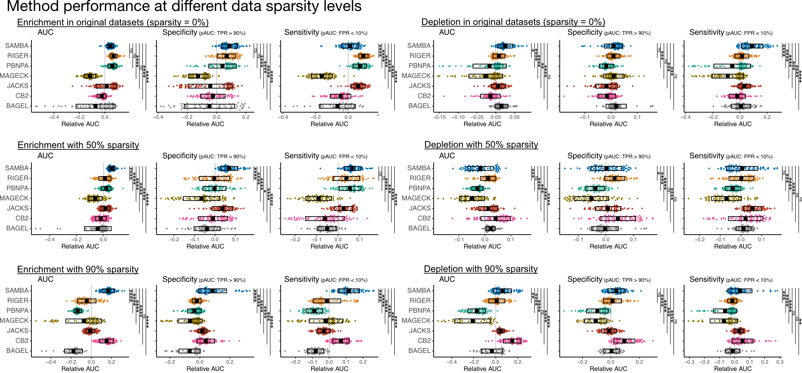

## SAMBA
CRISPR Screen Analysis Method with emperical Bayes estimation for
    Aggregated gene scoring (SAMBA). 

This analysis algorithm fit CRISPR screen data with negative binomial generalized linear models
(GLMs) with guide-wise quasi-dispersion estimates using empirical Bayes moderation. The 
posterior Bayesian estimates for each guide are then used to calculate gene-level scores with 
a modified weighted-sum algorithm. For each gene score, p values are calculated based on a null 
distribution of randomly sampled guide-sets (dummy genes). 

## Description
The SAMBA R package analyzes guide-level statistics and gene-level statistics using a workflow detailed in the figure below. Briefly, guide count data are preprocessed by adding a pseudo-count to all data instead of filtering low-count guides. This is a softer approach to distinguish low and high counts, rather than using a hard threshold  (Allen et al., Genome Res 2019). The data were then analyzed for guide-level changes using the edgeR package (Lun et al., Methods Mol Biol 2016) with TMMwsp normalization, effective for sparse data, and by fitting a negative binomial generalized linear model (GLM) with quasi-dispersion estimates and guide-detection weights, calculated using a sigmoid function of the proportion of non-control samples that had counts above a minimum threshold (5% quantile of all counts). Guide-level changes were analyzed by quasi-likelihood F tests, and guide scores were defined as the posterior Bayes estimates for each guide. Gene-level scores were then calculated, by adding (1) a baseline measurement for each gene (sum of guide-score quartiles Q2-4), and (2) a weighted sum of the guides whose scores are greater than the 90th percentile (representing a 10% FDR, similar to MAGeCK RRA (Li et al., Genome Biol 2014)). The gene scores are then normalized to the mean scores from scrambled “null-genes”. P values are then estimated from the normal probability distribution of normalized gene scores, and FDR-adjusted p values are calculated.


## Benchmarking SAMBA performance for enrichment analysis and sparse data
SAMBA was developed for enrichment analyses of sparse CRISPR screen data, which is a common occurance for in vivo screens of immune cells (Zhou and Renauer et al., Immuno Rev 2023). To assess the performance of SAMBA, we benchmarked it against six popular CRISPR screen analysis algorithms: BAGEL2 (Kim and Hart, Genome Med 2021), CB2 (Jeong et al., Genome Res 2019), JACKS (Allen et al., Genome Res 2019), MAGeCK (Li et al., Genome Biol 2014), PBNPA (Jia et al., BMC Genomics 2017), and Riger (RigerJ Java implementation: https://github.com/broadinstitute/rigerj). Specifically, the algorithms were used to analyze 71 CRISPR screen datasets of cancer cell proliferation/survival, generated from five large-scale publications (Wang et al., Science 2015; Wang et al., Cell 2017; Aguirre et al., Cancer Discov 2016; Meyers et al., Nat Genet 2017)


The overall performance of each method was compared using area-under-curve (AUC) values calculated with p values as the predictors for tumor suppressor genes (TSG; COSMIC database: https://cancer.sanger.ac.uk/cosmic; filtered for hallmark TSG; accessed on July 20, 2022) as a response of screen enrichment, or essential genes as a response of screen depletion (Hart et al., Cell 2015). Analysis specificity was then assessed by the partial-AUC (pAUC) with a true-positive rate > 90%, and sensitivity by the pAUC with a false-positive rate < 10%. In addition, all performance metrics were assessed in datasets where sparsity was simulated by randomly assigning a specified number of zeros, using probability weights determined by the counts in the control samples. 

When data sparsity was simulated in the testing data, SAMBA demonstrated robust performance for enrichment analysis specificity, sensitivity, and overall predictive capabilities, even in datasets where 90% of guides were undetected in each screen sample (**Figures below**). SAMBA was also benchmarked for the depletion of essential genes in the testing datasets. While SAMBA significantly improved overall depletion-screen performance to all methods other than BAGEL2 at baseline sparseness, SAMBA only performed modestly in depletion analyses with increasing sparsity (**Figures below**). 

The line plots below show the performance characteristics of different analysis methods, when guide detection is decreased (aka increased sparsity) among screen samples. Trendlines are the loess curves (opaque line) of AUC/pAUC values at each data sparsity level, shown with the standard error +/- the mean (shaded line).


Box plots showing the performance characteristics of different analysis methods at different levels of data sparsity. Each screen analysis result is shown by a dot, the mean +/- standard error is depicted by the boxes, and error bars are shown for the ANOVA analysis of rAUCs with post-hoc analysis using the Tukey method. Error bars are only shown for comparisons with SAMBA, and significance is based on FDR-adjusted p values. * < 0.05; ** < 1e-2; *** < 1e-3; **** < 1e-4.




## Install
```{r}
## Install packages
install.packages('devtools')  
devtools::install_github('Prenauer/SAMBA')

## Load SAMBA
library(SAMBA)
```


## Setting up the data
#### All you need to run SAMBA is a (1) dataframe of count data and (2) sample names. 
The example below demonstrates a simple screen analysis. However, more complex analyses
are possible by supplying a design matrix, and even a contrast matrix, to take full 
advantage of the GLM capabilities of SAMBA. 

##### (1) Get dataframe of sgRNA counts
This needs the following columns: sgRNA, Gene, counts. See the example "counts" 
dataset with four control and four screen samples below.

```{r}
## Create 4 screen and 4 control samples, each with random counts of 80,000 sgRNA.
samples.screen <- sapply(1:4, function(x) rnbinom(80000, mu = 1000, size = 0.2))  
samples.ctrl <- sapply(1:4, function(x) rnbinom(80000, mu = 1000, size = 1))  

## Generate names for the sgRNAs and genes included in the screen library.
library.sgrna <- sapply(1:80000, function(x) paste0('sgRNA_',x))  
library.gene <- c(unlist(lapply(1:(79000/4), function(x) rep(paste0('Gene_',x),4))), 
                  rep('NTC',1000))

## Create a dataframe with the CRISPR library information, followed by the sgRNA counts
##    for each sample.
counts <- data.frame(sgRNA = library.sgrna,
                     Gene = library.gene,
                     samples.ctrl,
                     samples.screen)
## Name the samples (optional).
colnames(counts)[3:10] <- c(paste0('Ctrl_',1:4), paste0('Screen_',1:4))
head(counts)
```

##### (2) Get sample names
Create character vectors of the screen samples and control samples.
```{r}
screen.names <- paste0('Screen_',1:4)
ctrl.names <- paste0('Ctrl_',1:4)
```

## Running the analysis
The simplest way to run SAMBA is to use the all-in-one "Samba" function, which is 
demonstrated below.
```{r}
## Run SAMBA using the count data, the sample 
##    Note that Samba works better when a non-targeting control is used. In the
##    example dataset, these are named "NTC". Also note that the output is a list 
##    of sgRNA-level results and gene-level results.
results <- Samba(data = counts,
    screen.names=screen.names,
    ctrl.names=ctrl.names,
    control.gene='NTC',
    coefficient = 'screen')

## View Gene-level results.
head(results$GeneResults)
```

